# PersonFollowingRobot
Person Following Robot - Smart Trolley utilizing Artificial Intelligence (AI) and 3D vision
---

This project will introduce a Person Following Robot that can follow a person on various complex floors in indoor environments under many challenges: illuminating conditions, pose changes, occlusions, transiently losing the target, the target being covered, etc... 

Applied techniques:
- Deep Learning: Object Detection and Single Object Tracking with Vision Transformer
- 3D vision, point cloud processing, depth image (Realsense camera)
- Implement in ROS platform

<div align="center">
    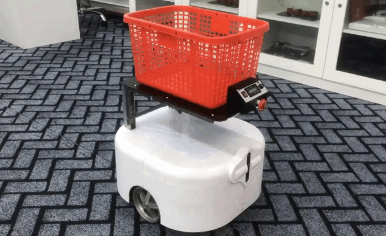
</div>

## Hardware specs

- Battery: 18650, 18 cells, 24V 7800mAh
- Voltage Regulator Circuit: 5V-5A
- Motor Driver: Planet 24VDC 60W 600RPM
- H-Bridge Driver
- Camera: Intel RealSense Depth D455
- Microcontroller: STM32F103C8T6
- Board Computer: Jetson Nano

## Recognizing floor

The 3D vision algorithms can recognize various types of floors and in different lighting conditions.

<div align="center">
    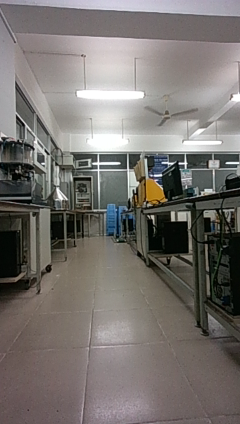
    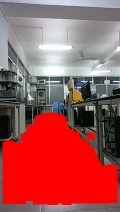
    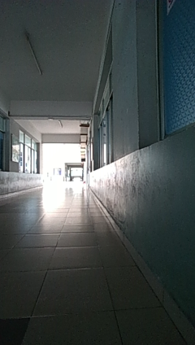
    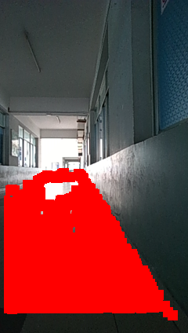
</div> 

<div align="center">
    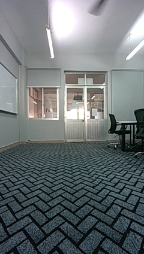
    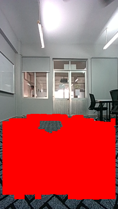
    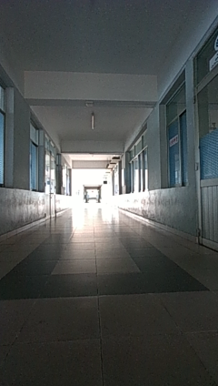
    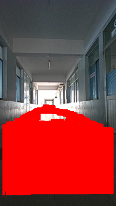
</div> 

## Detection and people tracking

To detect people, we used a pre-trained model available in [jetson-inference](https://github.com/dusty-nv/jetson-inference). [Stark](https://github.com/researchmm/Stark) is a single object tracking model using Vision Transformer that we experienced on my laptop to track one person in the frame in different complex cases. All models were converted to TensorRT to accelerate inference speed.

<div align="center">
    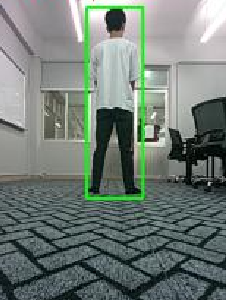
    
</div> 

## ROS system

<div align="center">
    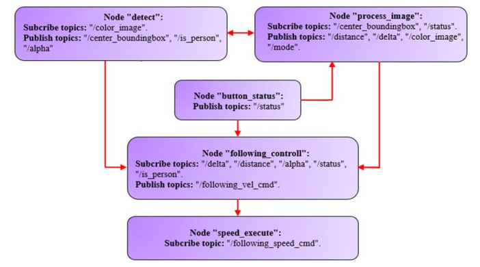
</div>

## Result

The robot aims to operate steadily and is user-friendly.

https://user-images.githubusercontent.com/93960908/232410834-9a1db43f-5987-4144-8dd2-8d65ff443436.mp4

## Authors

To further information, feel free to contact me (Huy An) via Zalo 0773891493 or my team via email:

```
Nguyen Huy An:      anhuynguyen001@gmail.com - AI and Computer Vision
Ngo Tan Hau:        ngotanhauios@gmail.com  - Hardware and Microcontrol
Pham Trung Nghia:   nghiatrung333@gmail.com - Mechanical
```
